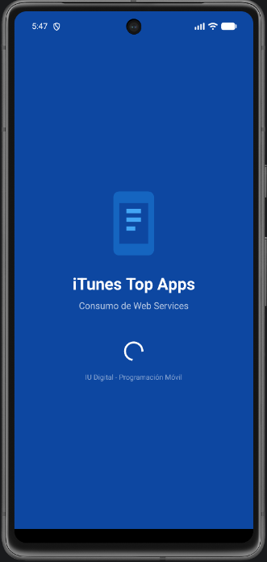
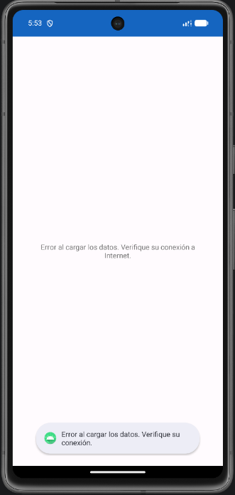

# 📱 Aplicación Android: WebServices con iTunes RSS

Una aplicación nativa para Android desarrollada en **Java** que consume el servicio web público de **iTunes RSS** para listar y categorizar las **20 aplicaciones gratuitas más populares**. Esta aplicación utiliza la librería **Volley** para realizar peticiones HTTP asíncronas y cargar imágenes de forma dinámica.

---

## 📸 Capturas de Pantalla

Para que puedas apreciar el diseño y la interfaz de usuario de la aplicación, aquí tienes las capturas de las diferentes pantallas:

| ⏳ Splash Screen (Bienvenida) | 🏁 Vista Inicial (Menú) | 📱 Listado de Apps | 🏷️ Categorías de Apps | ⚠️ Pantalla de Error |
|:---:|:---:|:---:|:---:|:---:|
|  |  |  |  |  |

---

## 🚀 Características Principales

*   **Integración de Web Services:** Consumo de una API REST pública en formato JSON (`https://itunes.apple.com/us/rss/topfreeapplications/limit=20/json`).
*   **Peticiones Asíncronas Eficientes:** Uso de **Volley** para descargar y procesar los datos JSON en segundo plano de manera optimizada, garantizando una experiencia de usuario fluida y sin bloqueos en el hilo principal de la interfaz de usuario (UI Thread).
*   **Carga de Imágenes en Tiempo Real:** Implementación de `ImageRequest` de Volley para descargar y renderizar dinámicamente los iconos/portadas de las aplicaciones.
*   **Navegación Intuitiva:** Pantalla inicial con un menú dinámico para acceder al listado general de aplicaciones o a la clasificación por categorías.
*   **Adaptadores Personalizados (`Adapters`):**
    *   `Menu_Adapter`: Administra la pantalla de bienvenida con iconos personalizados.
    *   `AppAdapter`: Renderiza de manera detallada el icono de la app, el título, los derechos de autor (`rights`) y un resumen descriptivo (`summary`).
    *   `CategoryAdapter`: Agrupa y presenta las aplicaciones destacando principalmente su categoría de software.

---

## 🛠️ Tecnologías y Librerías Utilizadas

*   **Lenguaje:** Java ☕ (Compatible con Java 11)
*   **SDK Mínimo:** API 24 (Android 7.0 Nougat)
*   **SDK de Compilación (Compile SDK):** API 36 (Android 16)
*   **Librería de Red:** [Volley](https://developer.android.com/training/volley) (v1.2.1) - Para peticiones HTTP asíncronas de JSON e imágenes.
*   **Diseño de UI:** Material Design Components, `ConstraintLayout`, y layouts basados en `ListView`.

---

## 📁 Estructura del Proyecto (Código Fuente)

Las clases clave de la aplicación están organizadas de la siguiente manera dentro del paquete `com.example.webservicesaplication`:

*   **`MenuActivity.java`**: Actividad que maneja el menú principal de la aplicación con las opciones "Listado de Apps" y "Categorías" utilizando un `ListView`.
*   **`MainActivity.java`**: Actividad principal receptora que procesa la selección del usuario desde el menú inicial y le asocia el adaptador correspondiente (`AppAdapter` o `CategoryAdapter`).
*   **`AppModel.java`**: Modelo de datos estructurado que encapsula la información de cada aplicación (nombre, url de imagen, resumen, derechos y categoría).
*   **`Menu_Adapter.java`**: Adaptador para el menú de opciones inicial, asignando iconos según la opción seleccionada de forma dinámica.
*   **`AppAdapter.java`**: Adaptador personalizado que realiza la llamada al Web Service, parsea el objeto JSON de iTunes, administra la lista y descarga los iconos usando `ImageRequest` de Volley.
*   **`CategoryAdapter.java`**: Adaptador especializado que consume el mismo servicio web pero formatea la lista priorizando el nombre de la categoría del software en pantalla.

---

## 🔌 API de iTunes Consumida

La aplicación interactúa con el siguiente endpoint público de Apple:
```http
GET https://itunes.apple.com/us/rss/topfreeapplications/limit=20/json
```

### Estructura del JSON Parseado:
```json
{
  "feed": {
    "entry": [
      {
        "im:name": { "label": "Nombre de la Aplicación" },
        "summary": { "label": "Resumen o descripción de la app..." },
        "im:image": [
          { "label": "url_imagen_pequeña" },
          { "label": "url_imagen_mediana" },
          { "label": "url_imagen_grande" }
        ],
        "rights": { "label": "© Derechos de autor de la App" },
        "category": {
          "attributes": { "label": "Categoría (ej. Juegos, Finanzas)" }
        }
      }
    ]
  }
}
```

---

## ⚙️ Configuración e Instalación

Para clonar, ejecutar y probar este proyecto en tu máquina local, sigue estos sencillos pasos:

### 1. Clonar el repositorio
Usa la terminal para clonar el repositorio mediante SSH:
```bash
git clone git@github.com:YonierAlexisQuiceno/WebServices.git
```
O mediante HTTPS:
```bash
git clone https://github.com/YonierAlexisQuiceno/WebServices.git
```

### 2. Abrir en Android Studio
1. Abre **Android Studio** (versión recomendada Ladybug o superior).
2. Selecciona **File > Open** y navega hasta la carpeta del proyecto clonado `WebServicesAplication`.
3. Espera a que **Gradle** finalice la sincronización e indexación de dependencias del proyecto.

### 3. Ejecutar la Aplicación
1. Asegúrate de tener un Emulador (AVD) activo o un dispositivo Android físico conectado mediante USB con la **Depuración por USB** activada.
2. Presiona el botón verde **Run** (`Shift + F10`) en Android Studio para compilar, instalar y ejecutar el proyecto.

---

## 📄 Licencia

Este proyecto es de código abierto y está disponible bajo la [Licencia MIT](LICENSE). Siéntete libre de clonarlo, estudiarlo, modificarlo y usarlo para fines educativos.
